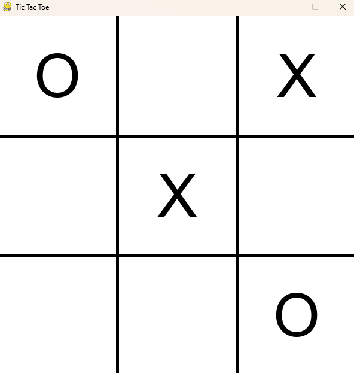

# Tic Tac Toe en Python

Este es un juego clásico de **Tic Tac Toe** (Tres en Línea) desarrollado en **Python** utilizando la biblioteca **Pygame**. El juego permite a dos jugadores competir entre sí, alternando turnos para colocar sus marcas en un tablero de 3x3.

<p align="center">
  
</p>

## Características

- **Modo de juego para 2 jugadores**.
- Jugadores se turnan para colocar una "X" o una "O" en un tablero de 3x3.
- El juego verifica automáticamente si hay un ganador después de cada turno.
- El tablero se actualiza dinámicamente, mostrando las marcas de los jugadores.
- El juego se reinicia automáticamente después de que un jugador gane.

## Requisitos

Para ejecutar este juego, necesitas tener Python 3.x instalado y la biblioteca **Pygame**.

### Instalación de Pygame

Si aún no tienes **Pygame** instalado, puedes hacerlo ejecutando el siguiente comando:

```bash
pip install pygame
